# Live Streamer 系统设计文档

## 概述

Live Streamer 是一个基于 Rust 和 Actix 框架构建的数字人直播交互系统。系统采用 Actor 模型和事件驱动架构，支持多平台直播弹幕集成，提供实时的数字人交互功能。

## 系统架构

### Actor 关系图

```mermaid
graph TD
    %% 核心事件总线
    EventBus[EventBus<br/>事件总线<br/>src/event_bus.rs]
    
    %% 主要Actor
    DigitalHuman[DigitalHumanActor<br/>数字人演员<br/>src/actor.rs]
    WSManager[WebSocketManager<br/>WebSocket管理器<br/>src/websocket.rs]
    WSSession[WebSocketSessionActor<br/>WebSocket会话<br/>src/websocket.rs]
    LiveManager[LiveStreamManager<br/>直播平台管理器<br/>src/live_platform.rs]
    
    %% 验证器和平台监听器
    Validator[TextValidator<br/>文本验证器<br/>src/validator.rs]
    DouyinListener[DouyinListener<br/>抖音监听器<br/>src/live_platform.rs]
    BilibiliListener[BilibiliListener<br/>B站监听器<br/>src/live_platform.rs]
    YouTubeListener[YouTubeListener<br/>YouTube监听器<br/>src/live_platform.rs]
    WSListener[WebSocketListener<br/>WebSocket监听器<br/>src/live_platform.rs]
    
    %% 事件类型
    UserConnEvent[UserConnectedEvent]
    UserDiscEvent[UserDisconnectedEvent]
    TextInputEvent[TextInputEvent]
    AudioInputEvent[AudioInputEvent]
    LLMResponseEvent[LLMResponseEvent]
    TTSResponseEvent[TTSResponseEvent]
    AnimationEvent[AnimationEvent]
    
    %% Actor注册关系
    EventBus -->|registers| DigitalHuman
    EventBus -->|registers| WSManager
    WSManager -->|creates| WSSession
    LiveManager -->|creates| DouyinListener
    LiveManager -->|creates| BilibiliListener
    LiveManager -->|creates| YouTubeListener
    LiveManager -->|creates| WSListener
    
    %% 事件流向关系
    WSSession -->|sends events| EventBus
    EventBus -->|validates via| Validator
    EventBus -->|forwards to| DigitalHuman
    DigitalHuman -->|publishes| LLMResponseEvent
    DigitalHuman -->|publishes| AnimationEvent
    EventBus -->|forwards to| WSManager
    WSManager -->|sends to| WSSession
    
    %% 直播平台数据流
    DouyinListener -->|DanmakuMessage| LiveManager
    BilibiliListener -->|DanmakuMessage| LiveManager
    YouTubeListener -->|DanmakuMessage| LiveManager
    LiveManager -->|TextInputEvent| EventBus
    
    %% 用户连接流
    WSSession -.->|UserConnectedEvent| EventBus
    WSSession -.->|UserDisconnectedEvent| EventBus
    WSSession -.->|TextInputEvent| EventBus
    WSSession -.->|AudioInputEvent| EventBus
    
    %% 响应流
    EventBus -.->|LLMResponseEvent| WSManager
    EventBus -.->|TTSResponseEvent| WSManager
    EventBus -.->|AnimationEvent| WSManager
    
    %% 样式定义
    classDef actorClass fill:#e1f5fe,stroke:#01579b,stroke-width:2px
    classDef eventClass fill:#f3e5f5,stroke:#4a148c,stroke-width:2px
    classDef listenerClass fill:#e8f5e8,stroke:#2e7d32,stroke-width:2px
    classDef validatorClass fill:#fff3e0,stroke:#e65100,stroke-width:2px
    
    class EventBus,DigitalHuman,WSManager,WSSession,LiveManager actorClass
    class UserConnEvent,UserDiscEvent,TextInputEvent,AudioInputEvent,LLMResponseEvent,TTSResponseEvent,AnimationEvent eventClass
    class DouyinListener,BilibiliListener,YouTubeListener,WSListener listenerClass
    class Validator validatorClass
```



## 核心组件详解

### 1. EventBus (事件总线)
**文件位置**: `src/event_bus.rs:10`

EventBus 是系统的核心组件，负责：
- 注册和管理所有 Actor
- 事件路由和分发
- 消息验证和过滤
- 解耦各组件间的直接依赖关系

**主要功能**:
- 注册 DigitalHumanActor 和 WebSocketManager
- 处理用户连接/断连事件
- 文本输入验证和转发
- 音频输入处理
- 响应事件分发

### 2. DigitalHumanActor (数字人演员)
**文件位置**: `src/actor.rs:9`

数字人核心逻辑处理单元：
- 管理用户会话和对话历史
- 处理文本和音频输入
- 生成 AI 响应
- 触发动画和表情事件
- 维护个性化设置

**关键特性**:
- 支持多会话并发处理
- 对话历史管理
- 情感和动画生成
- 个性化响应

### 3. WebSocketManager (WebSocket管理器)
**文件位置**: `src/websocket.rs:8`

WebSocket 连接管理和消息处理：
- 管理所有 WebSocket 连接
- 创建和销毁会话 Actor
- 消息格式化和发送
- 连接状态维护

**支持的消息类型**:
- LLM 响应消息
- TTS 语音响应
- 动画事件
- 用户输入处理

### 4. WebSocketSessionActor (会话Actor)
**文件位置**: `src/websocket.rs:46`

单个 WebSocket 会话的处理单元：
- 处理单个用户连接
- 消息发送和接收
- 会话生命周期管理
- 异步消息处理

### 5. LiveStreamManager (直播平台管理器)
**文件位置**: `src/live_platform.rs:39`

多平台直播弹幕集成管理：
- 支持抖音、B站、YouTube 等平台
- 弹幕消息解析和转换
- 平台监听器生命周期管理
- 统一消息格式转换

**支持平台**:
- 抖音 (DouyinListener)
- B站 (BilibiliListener) 
- YouTube (YouTubeListener)
- WebSocket (WebSocketListener)

### 6. TextValidator (文本验证器)
**文件位置**: `src/validator.rs:33`

内容安全和质量控制：
- 敏感词过滤
- 频率限制
- 内容长度验证
- 用户行为统计

**验证规则**:
- 黑名单过滤
- 发言频率限制
- 消息长度检查
- 用户等级验证

## 数据流分析

### 1. 用户交互流程
```
用户输入 → WebSocketSessionActor → EventBus → TextValidator → DigitalHumanActor → EventBus → WebSocketManager → 用户
```

### 2. 直播弹幕处理流程
```
直播平台 → PlatformListener → LiveStreamManager → EventBus → DigitalHumanActor → 响应生成
```

### 3. 响应生成流程
```
DigitalHumanActor → LLMResponseEvent/AnimationEvent → EventBus → WebSocketManager → 客户端显示
```

## 事件系统

### 核心事件类型
- **UserConnectedEvent**: 用户连接事件
- **UserDisconnectedEvent**: 用户断连事件  
- **TextInputEvent**: 文本输入事件
- **AudioInputEvent**: 音频输入事件
- **LLMResponseEvent**: AI 响应事件
- **TTSResponseEvent**: 语音合成响应
- **AnimationEvent**: 动画触发事件

### 事件元数据
所有事件都包含统一的元数据结构：
```rust
pub struct EventMetadata {
    pub id: Uuid,
    pub timestamp: DateTime<Utc>,
    pub session_id: Option<Uuid>,
    pub user_id: Option<String>,
}
```

## 技术特性

### 1. 异步并发处理
- 基于 Actix Actor 模型
- 消息驱动的异步处理
- 高并发会话支持

### 2. 模块化设计
- 松耦合组件架构
- 可插拔的平台监听器
- 灵活的验证规则系统

### 3. 实时通信
- WebSocket 双向通信
- 事件驱动的响应机制
- 低延迟消息处理

### 4. 多平台集成
- 统一的弹幕消息接口
- 可扩展的平台适配器
- 标准化的数据格式

## 扩展性考虑

### 1. 新平台接入
实现 `PlatformListener` trait 即可接入新的直播平台：
```rust
pub trait PlatformListener: Send {
    fn start(&mut self) -> Result<(), Box<dyn std::error::Error>>;
    fn stop(&mut self);
    fn is_running(&self) -> bool;
}
```

### 2. 自定义验证规则
通过扩展 `RuleType` 枚举添加新的验证逻辑

### 3. 事件类型扩展
实现 `Event` trait 可以添加新的事件类型

## 部署架构

系统部署为单个 HTTP 服务器，监听端口 8080：
- REST API 接口
- WebSocket 连接端点
- 静态资源服务
- 健康检查接口

## 配置管理

### 直播平台配置
```rust
pub struct LiveStreamConfig {
    pub platform: Platform,
    pub room_id: String,
    pub api_key: Option<String>,
    pub webhook_url: Option<String>,
    pub enabled: bool,
}
```

### 验证规则配置
```rust
pub struct ValidationRule {
    pub id: String,
    pub name: String,
    pub rule_type: RuleType,
    pub enabled: bool,
    pub parameters: serde_json::Value,
}
```

## 性能特性

- **低延迟**: Actor 模型确保消息快速处理
- **高并发**: 支持大量并发连接和会话
- **内存效率**: Rust 零成本抽象和内存安全
- **可扩展**: 事件驱动架构支持水平扩展

## 安全考虑

- 输入验证和敏感词过滤
- 频率限制防止恶意刷屏
- WebSocket 连接管理和清理
- 错误处理和日志记录

这个设计文档描述了 Live Streamer 系统的整体架构和核心组件，为开发和维护提供了清晰的技术指导。